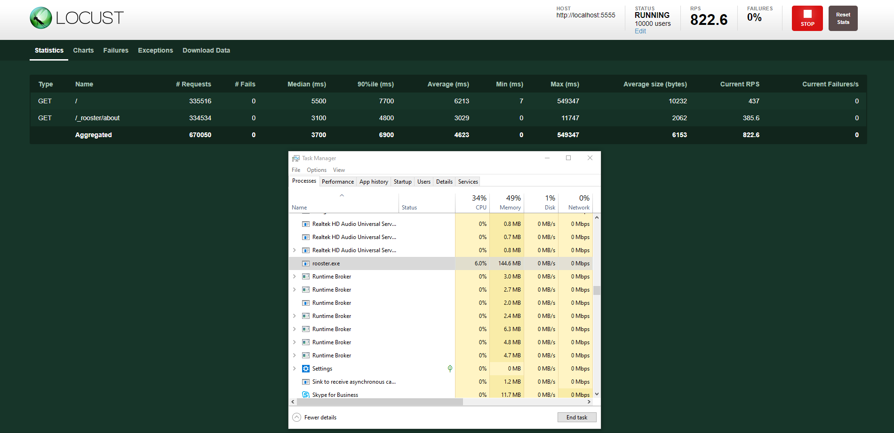
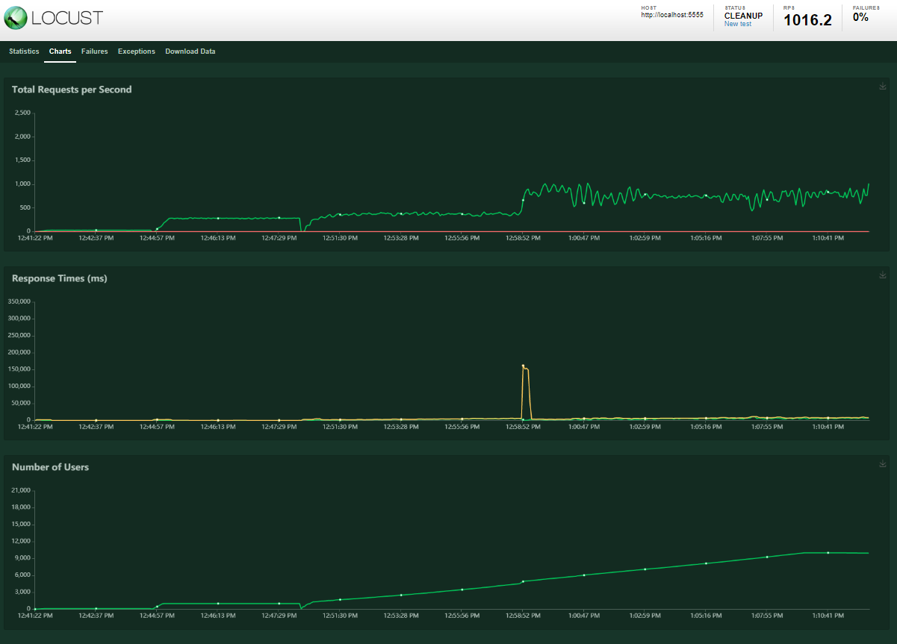

# Rooster
A tiny footprint application server with Rust. This is an experimental project created as an attempt to scratch a personal itch but with growing ambitions. It is currently a single executable of about ~3 MB in size.

# Announcements
## Aug 2020
- Script Support
  - Rooster now has a very basic JS server script support
  - It is ES5 compliant and uses [Duktape engine](https://duktape.org/) via the [Ducc](https://github.com/SkylerLipthay/ducc) rust bindings
  - It can load and serve script files including external libraries such as Moment JS, Math JS and more.
  - Examples can be found in the test repository [here](https://github.com/elasmojs/rooster-test)

## Downloads
[Windows 32 bit](./dist/rooster-win32.exe)

[Windows 64 bit](./dist/rooster-win64.exe)

## Installation
Just copy rooster executable to your web root folder and run!

### default mode
- Your web root folder
  - index.html
  - rooster.exe
  
### with customized configuration
- Your web root folder
  - index.html
- rooster.exe
- rooster.cfg

## Custom Configuration
Adding a rooster.cfg file in the same folder as the rooster.exe file can be used to modify the following properties

[Sample Configuration](rooster.cfg)

## Administration
Rooster is windowless and currently does not also support system tray. All administration is through the /_rooster route

### /_rooster/about
A small about Rooster page

### /_rooster/shutdown
Shuts the server down. (Allows requests orginating from localhost only)

## Tests Repo
The Rooster tests repo is [here](https://github.com/elasmojs/rooster-test). Check it out for some simple examples of using Rooster.

## Performance
10K user test with Locust running on same 16GB RAM laptop

## Upcoming
- Script support
  - Script APIs roadmap
- SSL support
- Improved log handling
- Daemon/Windows Service support
